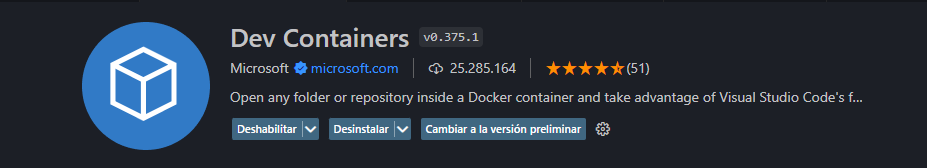

# GoldenGateTheMostIncredibleThing

Este sitio hecho en honor al Golden Gate esta construido construido con React mediante NextJS, además de, TailwindCSS, ShadCN y Typescript. Esto principalmente porque fue utilizado para re-aprender desarrollo frontend con tecnologías actuales y con beneficios como el ServerSide Rendering.

Además, se usaron tecnologías de apoyo para el desarrollo como lo son Docker/DevContainer de manera de asegurar su correcta ejecución en cualquier SO.

Para ejecutar esta App se puede ejecutar con Docker, DevContainer o directamente con la aplicación.

## DevContainer (Recomendado)

Dev Containers es una tecnología basada en contenedores que permite útilizar imágenes de docker directamente conectadas a VSCode, de esta manera todas las dependencias de desarrollo quedan encapsuladas en el contenedor -incluso las extensiones útilizadas- y no se carga contenido "basura" dentro de la máquina Host.
Para utilizar devcontainer basta con instalar la extensión "Dev Containers" en VSCode y Docker Desktop.



Una vez instalado solo es necesario ejecutar `npm run dev` para ejecutar la aplicación en
http://localhost:3000/

This is a [Next.js](https://nextjs.org/) project bootstrapped with [`create-next-app`](https://github.com/vercel/next.js/tree/canary/packages/create-next-app).

## Getting Started

First, run the development server:

```bash
npm run dev
# or
yarn dev
# or
pnpm dev
# or
bun dev
```

Open [http://localhost:3000](http://localhost:3000) with your browser to see the result.

You can start editing the page by modifying `app/page.tsx`. The page auto-updates as you edit the file.

This project uses [`next/font`](https://nextjs.org/docs/basic-features/font-optimization) to automatically optimize and load Inter, a custom Google Font.

## Learn More

To learn more about Next.js, take a look at the following resources:

-   [Next.js Documentation](https://nextjs.org/docs) - learn about Next.js features and API.
-   [Learn Next.js](https://nextjs.org/learn) - an interactive Next.js tutorial.

You can check out [the Next.js GitHub repository](https://github.com/vercel/next.js/) - your feedback and contributions are welcome!

## Deploy on Vercel

The easiest way to deploy your Next.js app is to use the [Vercel Platform](https://vercel.com/new?utm_medium=default-template&filter=next.js&utm_source=create-next-app&utm_campaign=create-next-app-readme) from the creators of Next.js.

Check out our [Next.js deployment documentation](https://nextjs.org/docs/deployment) for more details.
